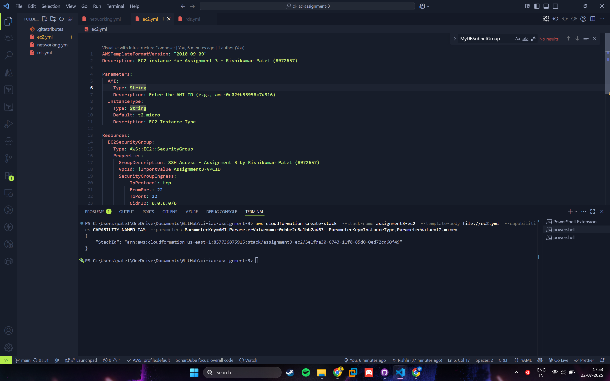

# Assignment 3 – Deploying AWS EC2 and RDS using CloudFormation

**Name:** Rishikumar Patel
**Student ID:** 8972657
**Course:** PROG8870 – Cloud Architectures and Infrastructure as Code

---

## 📚 Assignment Overview

This assignment involves deploying the following infrastructure using AWS CloudFormation:

- VPC, Subnets, Route Table, and Internet Gateway
- EC2 instance with SSH access
- MySQL RDS instance with public access

---

## 🧾 Files Included

- `networking.yml` – CloudFormation template for networking resources
- `ec2.yml` – Template to deploy EC2 with security group
- `rds.yml` – Template for public RDS MySQL deployment

---

## 🖼️ Screenshots

1. **VPC, Subnets, Internet Gateway** – AWS VPC Dashboard


 2. **EC2 Instance Running** – Show public IP


3. **RDS Instance Created** – From AWS RDS dashboard

 4. **CloudFormation Stack Outputs & Events** – For all 3 stacks 5. **CLI Stack Creation Output** – Terminal screenshots


---

## 🧪 CLI Deployment Commands

### Deploy Networking Stack

```bash
aws cloudformation create-stack   --stack-name assignment3-networking   --template-body file://networking.yml   --capabilities CAPABILITY_NAMED_IAM
```


### Deploy EC2 Stack

```bash
aws cloudformation create-stack   --stack-name assignment3-ec2   --template-body file://ec2.yml   --capabilities CAPABILITY_NAMED_IAM   --parameters ParameterKey=AMI,ParameterValue=ami-0cbbe2c6a1bb2ad63                ParameterKey=InstanceType,ParameterValue=t2.micro
```



### Deploy RDS Stack

```bash
aws cloudformation create-stack   --stack-name assignment3-rds   --template-body file://rds.yml   --capabilities CAPABILITY_NAMED_IAM   --parameters ParameterKey=DBUsername,ParameterValue=admin                ParameterKey=DBPassword,ParameterValue=Password123!
```


---
